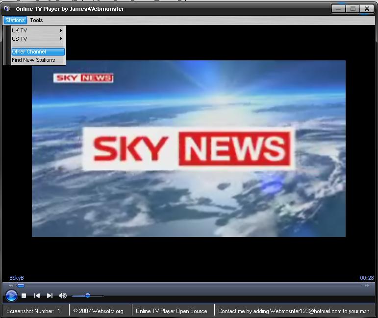



## Online TV Player

### Description

This program will play a TV station of your choice, I haven't added all stations but there is a link to get more, all you need to run this program is Windows Media Player 11.
 
### More Info
 

             |
---                |---
**Submitted On**   |2007-02-25 00:40:02
**By**             |[Webmonster](https://github.com/Planet-Source-Code/PSCIndex/blob/master/ByAuthor/webmonster.md)
**Level**          |Intermediate
**User Rating**    |3.8 (19 globes from 5 users)
**Compatibility**  |VB 6\.0
**Category**       |[Complete Applications](https://github.com/Planet-Source-Code/PSCIndex/blob/master/ByCategory/complete-applications__1-27.md)
**World**          |[Visual Basic](https://github.com/Planet-Source-Code/PSCIndex/blob/master/ByWorld/visual-basic.md)
**Archive File**   |[Online\_TV\_2050032252007\.zip](https://github.com/Planet-Source-Code/webmonster-online-tv-player__1-67974/archive/master.zip)

